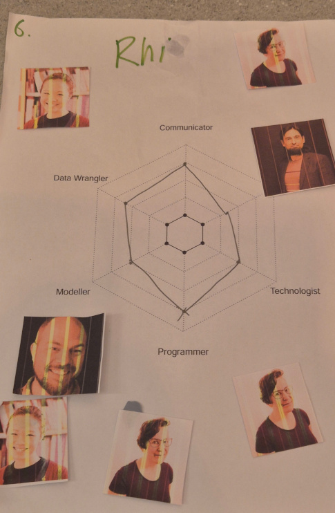
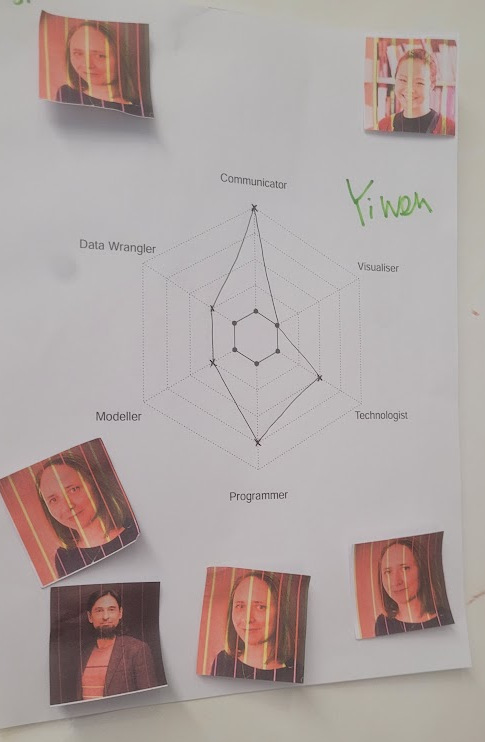
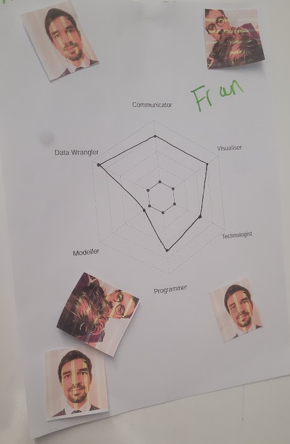

At our [The Strategy Unit Data Science team](https://the-strategy-unit.github.io/data_science/) (SUDS 🧼) away day, I ran a  short session reflecting on the skills of the team, both as individuals and as a whole.

It was intended as a short fun activity to get us up and moving and after a lot of technical meetings rather than a serious skills matrix. However, it started some valuable discussions so you might find it helpful to use. Feel free to borrow / adapt this idea for your own sessions.

I chose the following categories based on the [Mango data science radar](https://www.r-bloggers.com/2015/11/launching-the-data-science-radar/)[^1], but you can choose any that make sense for your team

[^1]: Mango Solutions was a data science consultancy that no longer exists.

- Communicator
- Visualiser
- Technlogist
- Programmer
- Modeller
- Data Wrangler

1. I gave out a blank skills "spider web"/radar chart, with 6 common data science skills. Each data scientist secretly scored themselves between 1 and 7.

1. I hung the anonymous radars on the wall, and we had to match the radar to the data scientist. We did this by sticking a photo of their face [^2] on the radar we thought belonged to them. It was interesting to see commonalities across team members and also to see the strengths and breadth across the team.

1. Once all guesses were made, I did the reveal one radar at a time, getting the person to talk through their strengths / enjoyments
1. We looked at the similarities (for example people often confused me with YiWen as we both like communicating)
1. I averaged across the team for each skill and drew a "team level" radar.

[^2]: As you'll see in the photographs later, my printer was running very low on ink.


Below are some of the team's radars, and who we guessed they belonged to. 

::: {layout-ncol=3}
{fig-alt="A piece of paper with a radar chart with the 6 skills around the outside. There are 3 photos of my face stuck to the paper, and 4 other photos of my colleages. I scored myself highly on Programmer and Communicator."}

{fig-alt="A piece of paper with a radar chart with the 6 skills around the outside. YiWen has high values for Programmer and Communicator."}

{fig-alt="A piece of paper with a radar chart with the 6 skills around the outside. Fran has high values for Data Wrangler, Visualiser and Communicator."}
:::

Three people corrected guessed my radar. Being strong in communication made other team members think it was YiWen (who I do share skill similarities with).

No one guessed that Fran's radar belonged to him, probably because Fran was brand new to the team and people hadn't got to know him and his skills[^3] yet.

[^3]: Fran is so brilliant at data wrangling, we now refer to it as _data frangling_ within SUDS 🦸

You can download [a PDF of a blank radar chart](img/radar.pdf), and the R code I used to generate it (using the [{fmsb} package](https://cran.r-project.org/web/packages/fmsb/index.html)).

```
skills <- c("Communicator", "Technologist", "Programmer",
          "Modeller", "Data Wrangler", "Visualiser")

n_levels <- 7
n_skills <- length(skills)

data <- as.data.frame(matrix(c(rep(n_levels, n_skills),
                               rep(0, n_skills),
                               rep(NA, n_skills)),
                             byrow = TRUE, nrow = 3))
colnames(data) <- skills
rownames(data) <- c("max", "min", "values")

fmsb::radarchart(data, seg = n_levels,
           vlcex      = 0.9, # size of the axis label text
           cglcol = "grey60" # colour of the lines
)
```
